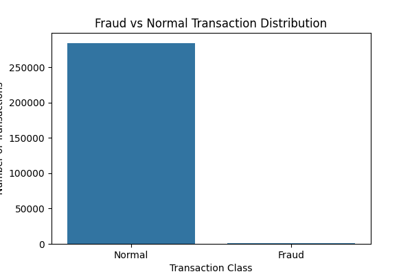
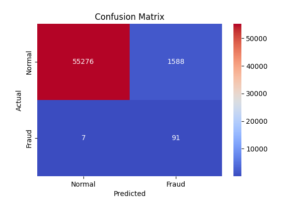

# Credit Card Fraud Detection

Machine learning project that detects fraudulent credit card transactions using classification models.

## Features
- Fraud vs normal transaction analysis
- Logistic Regression model
- Confusion matrix evaluation
- Fraud distribution visualization

## Technologies
Python  
Pandas  
NumPy  
Matplotlib  
Seaborn  
Scikit-learn  

## Output

### Fraud Distribution

### Confusion Matrix

## Run the Project

Install dependencies:

pip install -r requirements.txt

Run the script:

python fraud_detection.py
